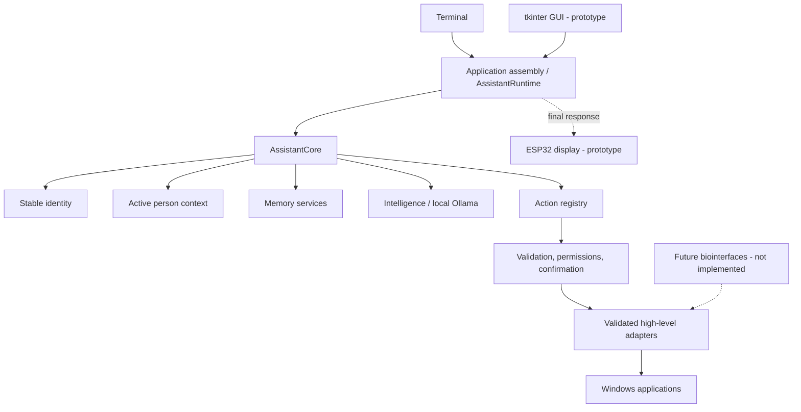

# Fripouille

`A local, embodied personal AI architecture`

Fripouille is an experimental architecture for a personal AI assistant that
runs locally and can be embodied through different interfaces. Today, its
main usable form is a Python assistant on Windows backed by a local Ollama
model. A terminal interface, a provisional tkinter interface, structured
actions, and a controlled memory pipeline form the current software baseline.

The project is not tied to one robot body. Its central aim is to preserve the
same cognitive architecture while interfaces evolve from a desktop to a
mobile robot or, much later, other experimental forms of human-computer
interaction.

## What is Fripouille?

Fripouille separates conversational interpretation from application
authority. The language model interprets a request, reasons about it, and
proposes a structured result. Python code validates that result, applies
deterministic rules, requests confirmation when required, and decides whether
an action may run.

The current assistant includes a stable identity, bounded conversation
context, a minimal active-person context, local persistence for tasks, journal
entries and memories, and an allowlisted Windows application launcher.

## Why this project?

This personal project explores how an assistant can progressively acquire
identity, memory, relationships, learning, internal state, roles, and physical
interfaces without collapsing those concepts into a single model prompt.

It is also an engineering exercise in keeping a probabilistic model behind
explicit software boundaries: the LLM can propose; the application remains
responsible for effects.

## Current status

| Area | Status | Current scope |
| --- | --- | --- |
| Python core and runtime | Functional | Structured local conversation pipeline |
| Ollama integration | Functional | Local API with `qwen3.5:9b` by default |
| Terminal interface | Functional | Historical and diagnostic interface |
| tkinter interface | Prototype | Provisional Windows chat window |
| Identity | Functional | Stable, immutable Fripouille identity |
| People | Functional | Minimal active-person context; no persistent social profiles |
| Tasks, journal and manual memory | Functional | Local SQLite repositories and validated actions |
| Contextual and automatic memory | Functional | Retrieval, candidates, controlled promotion and correction |
| Windows application launching | Functional | Allowlist, permission policy, confirmation, no shell |
| PC-to-ESP32 display path | Prototype | Tested software layers and associated firmware; no end-to-end hardware claim |
| Complete mobile robot | Roadmap | Developed as a separate robotics direction |
| Bioelectrical interfaces | Experimental direction | Future interface research; no EGM, EMG or EEG integration exists here |

## Architecture



The main flow is `interface -> AssistantRuntime -> AssistantCore ->
intelligence/actions`. Identity, conversation, people, memory, future
relationships and learning, internal state, roles, actions, and physical
interfaces remain separate responsibilities. See
[the architecture document](docs/architecture.md) for the detailed boundaries.

## Embodiment

Fripouille's identity and cognitive pipeline are intended to remain usable
across different physical forms.

### Mobile robot

The long-term robotics direction includes locomotion, an expressive head,
vision, a screen, arms, sensors, tools, and physical interaction. The complete
robot is developed separately and is not an integrated capability of this
repository today.

This repository does contain a prototype Windows-to-ESP32 display path and
ESP32-S3 firmware for text and a simple face. These components are not
presented as a fully validated robot integration.

### Bioelectrical interfaces

Bioelectrical interaction is an experimental direction for future research,
potentially involving EGM, EMG, EEG, or other human signals depending on later
experiments. There is currently **no EGM, EMG, or EEG integration** in this
repository.

## Safety and authority model

| Layer | Responsibility |
| --- | --- |
| LLM | Interpret, reason, and propose |
| Application | Validate, enforce rules, request confirmation, and authorize effects |
| Hardware | Receive only framed, application-controlled commands |

The LLM never receives direct access to GPIO, PWM, motors, repositories,
shells, or other critical hardware primitives. Actions use a closed registry,
validated parameters, permission decisions, and explicit confirmation for
sensitive operations. The Windows launcher resolves only application-defined
allowlist entries and uses no shell.

## Quick start

Requirements:

- Windows 10;
- Python 3.14 or newer;
- [Ollama](https://ollama.com/) running locally;
- the `qwen3.5:9b` model.

Prepare the local model:

```powershell
ollama pull qwen3.5:9b
```

If Ollama is not already running through its Windows application, start it in
a separate terminal with `ollama serve`. Then, from the repository root:

```powershell
python -m venv .venv
.\.venv\Scripts\Activate.ps1
python -m pip install --editable .
python -m assistant_ia
```

Use `python -m assistant_ia --gui` for the provisional tkinter interface and
add `--debug` to either mode for console diagnostics.

The default database is created outside the repository under
`%LOCALAPPDATA%\assistant-ia\assistant_ia.db`.

## Tests

```powershell
.\.venv\Scripts\python.exe -m unittest discover -s tests
```

The current repository state passes **561 tests**. This count describes the
present revision and will evolve with the project.

## Repository guide

- [Code reading guide](docs/READING_GUIDE.md) — a progressive tour through the
  current Python implementation.
- [Codex map](docs/CODEX_MAP.md) — a concise operational map for locating code.
- [Architecture](docs/architecture.md) — layers, pipelines, boundaries, and
  dependencies.
- [Roadmap](docs/roadmap.md) — FRP-IA milestones and their evidence-based
  status.
- [Development](docs/development.md) — setup, validation, and contribution
  principles.
- [Hardware](docs/hardware.md) — the current PC/ESP32 prototype boundary.
- [Privacy and security](docs/privacy-and-security.md) — local data and
  authority controls.

## Roadmap

The completed baseline covers FRP-IA-00 through FRP-IA-03, including the
FRP-IA-02B GUI and the FRP-IA-03 contextual-memory series. The next planned
stages are profiles and relationships, behavioral learning, experience
feedback, consolidation, internal state, voice, face and expressions, social
vision, roles and professions, and cognitive integration.

The [full roadmap](docs/roadmap.md) distinguishes implemented work from future
research directions.

## Project status

Fripouille is a personal project in active development. Its architecture is
experimental, although the current Python baseline is covered by deterministic
unit tests. Desktop use is the primary supported form today; hardware paths
remain prototypes, and future embodiment directions are not current features.
