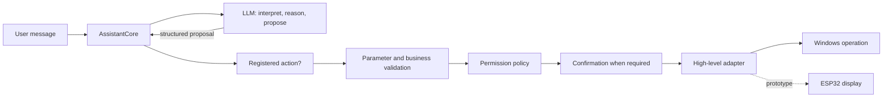

# Fripouille architecture

Fripouille is organized as a local assistant whose cognitive structure is not
owned by any one user interface or physical body. The current reference flow
is:

```text
interface -> AssistantRuntime -> AssistantCore -> intelligence / actions
```

`application.py` is the composition root. It creates the concrete Ollama
client, SQLite repositories, identity and person contexts, memory services,
action registry, permission policy, and Windows adapters used by the default
runtime.

## Layers and responsibilities

| Layer | Current responsibility |
| --- | --- |
| Interfaces | Acquire messages, display responses, and collect confirmations |
| `AssistantRuntime` | Keep user-facing presentation and diagnostics separate |
| `AssistantCore` | Orchestrate one turn without owning UI, SQL, Win32, or hardware details |
| Intelligence | Ask local Ollama for validated interpretations and conversational responses |
| Actions | Match a closed intent name, validate parameters, and invoke a registered handler |
| Security | Resolve allow, confirmation-required, or deny decisions |
| Memory | Persist tasks, journal entries and memories; retrieve and promote memory safely |
| High-level adapters | Launch allowlisted Windows applications or present text through a framed display protocol |

The core depends on protocols and domain services rather than directly on a
terminal, tkinter widget, SQL statement, Win32 handle, or ESP32 primitive.
This allows the same core to serve different interfaces.

## Conversation pipeline

A normal turn follows these boundaries:

```text
terminal or tkinter
    -> AssistantRuntime.process_message
    -> AssistantCore.process_message
    -> OllamaModelClient interprets the current turn
    -> validated Intent
        -> conversation path: bounded history + relevant memory -> response
        -> action path: registry -> validation -> handler -> response
    -> optional memory-candidate analysis
    -> application-controlled promotion proposal and confirmation
    -> user-facing presentation and separate diagnostics
```

Conversation and executable-action paths are exclusive for one interpreted
turn. Recent conversation history is bounded and separated from the current
message. Retrieved memories are local, read-only context; they do not become
instructions or proof that a statement is true.

Ollama responses cross validated schemas and closed intent definitions before
the application uses them. Business handlers then apply their own validation.
An intent is therefore a proposal, not an executed action.

## Separate cognitive domains

| Domain | Meaning in the current architecture | Status |
| --- | --- | --- |
| Identity | Immutable configuration describing Fripouille's stable identity | Implemented |
| Conversation | Temporary, bounded session history | Implemented |
| People | Persistent person registry and the active speaker for the current session | Implemented through FRP-IA-04B |
| Profile facts | Confirmed, person-scoped facts promoted from separate candidates | Implemented through FRP-IA-04C; no prompt injection yet |
| Memory | Persistent user-confirmed facts plus contextual retrieval | Implemented |
| Relationships | Persistent social profiles and relationship state | Not implemented |
| Learning | Behavioral adaptation derived from experience | Not implemented |
| Internal state | Persistent or evolving assistant state distinct from identity | Not implemented |
| Roles | Future contextual roles and professions, distinct from the identity's descriptive role field | Not implemented |
| Actions | Registered deterministic capabilities with validated parameters | Implemented |
| Physical interfaces | Presenters and controlled transports outside the cognitive core | Display prototype only |

These boundaries are deliberate. In particular, a model response cannot
mutate `AssistantIdentity`. A `ProfileFactCandidate` is not a truth or a
`Memory`: the application supplies its resolved person, classifies the
operation and requires confirmation before persistence. Relationships remain
separate and unimplemented.

## Authority boundary



The application is the authority at every solid boundary after the model. The
default permission policy denies unknown actions. Launching a Windows
application requires confirmation and resolves an application-defined
allowlist entry before `subprocess` is called without a shell.

Hardware receives only commands already constructed by controlled software.
The LLM has no GPIO, PWM, motor, serial-byte, or raw display API.

## Persistence and memory

`SQLiteDatabase` owns connection lifecycle, transactions, schema checks, and
migrations. Domain repositories own their SQL for tasks, journal entries, and
memories. The current schema version is 3.

Manual memory actions are explicit. Automatic analysis first creates
non-persistent candidates with source evidence. `MemoryPromotionService`
compares a candidate with existing memories and returns a proposal; the core
handles required confirmation before a repository write. Contextual retrieval
uses bounded, inspectable lexical scoring.

## Interfaces and embodiment

The terminal is the historical interface. The tkinter GUI is deliberately
provisional and calls the same runtime from a worker so the UI thread remains
responsive. A `ResponsePresenter` can receive the already resolved response
without participating in reasoning.

The physical-display path is a separate prototype composition:

```text
resolved response
    -> DisplayResponsePresenter
    -> DisplayController
    -> FramedSerialTransport
    -> WindowsSerialConnection
    -> ESP32 firmware
```

It is not wired into the default terminal or GUI startup path. See
[hardware.md](hardware.md) for the verified scope.

## Main dependencies

- Python 3.14 or newer and its standard library;
- Ollama's local HTTP API at `http://localhost:11434`;
- `qwen3.5:9b` as the default configured model;
- SQLite through Python's standard `sqlite3` module;
- tkinter for the provisional GUI;
- Win32 APIs through `ctypes` for the Windows serial adapter;
- ESP-IDF, the Waveshare board component, and LVGL for firmware builds.

The Python package currently declares no third-party runtime dependencies.

For a class-by-class learning path, continue with
[READING_GUIDE.md](READING_GUIDE.md). For the shortest navigation map, use
[CODEX_MAP.md](CODEX_MAP.md).
