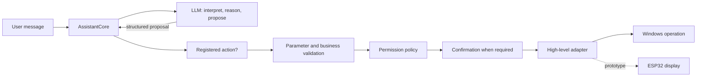

# Fripouille architecture

Fripouille is organized as a local assistant whose cognitive structure is not
owned by any one user interface or physical body. The current reference flow
is:

```text
interface -> AssistantRuntime -> AssistantCore -> intelligence / actions
```

`application.py` is the composition root. It creates the concrete Ollama
client, SQLite repositories, identity and person contexts, memory and
behavioral-learning services, action registry, permission policy, and Windows
adapters used by the default runtime.

## Layers and responsibilities

| Layer | Current responsibility |
| --- | --- |
| Interfaces | Acquire messages, display responses, and collect confirmations |
| `AssistantRuntime` | Keep user-facing presentation and diagnostics separate |
| `AssistantCore` | Orchestrate one turn without owning UI, SQL, Win32, or hardware details |
| Intelligence | Ask local Ollama for validated interpretations and conversational responses |
| Actions | Match a closed intent name, validate parameters, and invoke a registered handler |
| Security | Resolve allow, confirmation-required, or deny decisions |
| Memory | Persist tasks, journal entries and memories; retrieve and promote memory safely |
| Learning | Persist inspectable experiences and sourced lesson candidates without consolidation |
| High-level adapters | Launch allowlisted Windows applications or present text through a framed display protocol |

The core depends on protocols and domain services rather than directly on a
terminal, tkinter widget, SQL statement, Win32 handle, or ESP32 primitive.
This allows the same core to serve different interfaces.

## Conversation pipeline

A normal turn follows these boundaries:

```text
terminal or tkinter
    -> AssistantRuntime.process_message
    -> AssistantCore.process_message
    -> OllamaModelClient interprets the current turn
    -> validated Intent
        -> conversation path: bounded history + relevant memory -> response
        -> action path: registry -> validation -> handler -> response
    -> optional memory-candidate analysis
    -> application-controlled promotion proposal and confirmation
    -> user-facing presentation and separate diagnostics
```

No behavioral experience is captured automatically by this pipeline in
FRP-IA-05. `BehavioralLearningService` is an explicit application entry point
for a caller that already owns a verified context, objective, strategy and
result. It is not exposed as an Ollama intent or analyzer.

Conversation and executable-action paths are exclusive for one interpreted
turn. Recent conversation history is bounded and separated from the current
message. Retrieved memories are local, read-only context; they do not become
instructions or proof that a statement is true.

Ollama responses cross validated schemas and closed intent definitions before
the application uses them. Business handlers then apply their own validation.
An intent is therefore a proposal, not an executed action.

## Separate cognitive domains

| Domain | Meaning in the current architecture | Status |
| --- | --- | --- |
| Identity | Immutable configuration describing Fripouille's stable identity | Implemented |
| Conversation | Temporary, bounded session history | Implemented |
| People | Persistent person registry and the active speaker for the current session | Implemented through FRP-IA-04B |
| Profile facts | Confirmed, person-scoped facts promoted from separate candidates | Implemented and bounded in active-person context |
| Memory | Confirmed memories, optional person links and scoped contextual retrieval | Implemented through FRP-IA-04D |
| Relationships | Optional bounded relationship and unconfirmed observations per person | Implemented and bounded in active-person context |
| Learning | Inspectable experiences, evidence consolidation and reversible confirmed rules | Implemented through FRP-IA-07 |
| Internal state | Persistent or evolving assistant state distinct from identity | Not implemented |
| Roles | Future contextual roles and professions, distinct from the identity's descriptive role field | Not implemented |
| Actions | Registered deterministic capabilities with validated parameters | Implemented |
| Physical interfaces | Presenters and controlled transports outside the cognitive core | Display prototype only |

These boundaries are deliberate. In particular, a model response cannot
mutate `AssistantIdentity`. A `ProfileFactCandidate` is not a truth or a
`Memory`: the application supplies its resolved person, classifies the
operation and requires confirmation before persistence. Relationships remain
separate from identity and confirmed profile facts.

`Memory` remains independent from `Person`. A `MemoryPersonLink` records that
a person is an explicit subject of a memory; no displayed name is resolved by
this association layer. A memory may have no link, one subject or several
subjects. Automatic retrieval receives the application-resolved active person
ID and can see only that person's linked memories plus unassigned memories.
Memories linked exclusively to another person are filtered before prompt
construction.

## Authority boundary



The application is the authority at every solid boundary after the model. The
default permission policy denies unknown actions. Launching a Windows
application requires confirmation and resolves an application-defined
allowlist entry before `subprocess` is called without a shell.

Hardware receives only commands already constructed by controlled software.
The LLM has no GPIO, PWM, motor, serial-byte, or raw display API.

A future ROB adapter may return an application-validated high-level result
with an operation reference, final state, duration, error, collision and
success information. FRP-IA-05 can retain the resulting description and
structured provenance after such an adapter exists; it does not implement ROB
or raw signal processing for vision, EEG or EMG.

## Persistence and memory

`SQLiteDatabase` owns connection lifecycle, transactions, schema checks, and
migrations. Domain repositories own their SQL for tasks, journal entries,
memories, people, profile facts, memory/person links, bounded relationships,
unconfirmed observations, behavioral experiences and lesson candidates. The
current schema version is 8.

`PersonRelationship` has at most one row per persistent person and contains
only bounded familiarity and conversational interaction-style dimensions. It
is absent by default and has no security authority. `Observation` records a
categorized, sourced, confidence-bearing signal with the explicit status
`unconfirmed`; it never becomes a `ProfileFact` automatically.

`PersonSocialContextProvider` reads only the application-resolved active
person. Confirmed facts, the optional relationship and recent unconfirmed
observations are bounded independently and rendered in separate prompt
sections before contextual memories. Persistent identifiers, source evidence
and data belonging to another person never enter this social prompt context.
Relationship data is conversational guidance only and cannot alter identity,
permissions, confirmation or action validation.

Manual memory actions are explicit. Automatic analysis first creates
non-persistent candidates with source evidence. `MemoryPromotionService`
compares a candidate with existing memories and returns a proposal; the core
handles required confirmation before a repository write. Contextual retrieval
uses bounded, inspectable lexical scoring.

## Behavioral learning foundations

`BehavioralExperience` is a completed, inspectable record of context,
objective, attempted strategy, result and optional minimal evaluation. Its
`ExperienceProvenance` keeps a closed source type plus source reference and/or
exact source text where required. An experience may be global or carry a
foreign key to a persistent person selected through `ActivePersonContext`.

`BehavioralLessonCandidate` is deliberately weaker than a rule. It records a
context pattern, proposed strategy and rationale, and its many-to-many source
links point to the exact experiences used as evidence. One experience may
support a candidate, but neither one nor many experiences trigger automatic
creation, confirmation, prompt injection or behavior changes.

Both records can be inspected, corrected, invalidated with a reason and
deleted. An experience that still supports a candidate cannot be deleted;
the candidate must first be removed so provenance is never silently broken.
Person-scoped list operations use an exact application-resolved identifier and
never mix another person's rows or global rows.

FRP-IA-06 ajoute un résultat applicatif structuré et un chemin explicite
tentative → issue → `BehavioralExperience`. Les feedbacks utilisateur sont
typés (approbation, désapprobation, correction ou réessai) et les mesures sont
factuelles, sans score universel. Une issue technique reste distincte d'une
évaluation comportementale ; une tentative non exécutée n'est pas persistée.
Le résultat connu de l'application prime toujours sur une interprétation LLM.
La consolidation FRP-IA-07 recalcule une synthèse déterministe des preuves
actives (favorables, contradictoires, ambiguës, invalidées et doublons de
provenance). Une règle n'est créée qu'après confirmation explicite de
l'application ; elle conserve ses sources, est invalidable/supprimable et
n'est pas injectée dans les prompts. L'intégration appartient à FRP-IA-13.
FRP-IA-07 now provides comparison, contradiction handling, consolidation,
explicit validation/rejection and reversible confirmed behavioral rules.
Their future use in prompts remains reserved for FRP-IA-13.
Identity, roles and internal state have no dependency on the learning models.

## Interfaces and embodiment

The terminal is the historical interface. The tkinter GUI is deliberately
provisional and calls the same runtime from a worker so the UI thread remains
responsive. A `ResponsePresenter` can receive the already resolved response
without participating in reasoning.

The physical-display path is a separate prototype composition:

```text
resolved response
    -> DisplayResponsePresenter
    -> DisplayController
    -> FramedSerialTransport
    -> WindowsSerialConnection
    -> ESP32 firmware
```

It is not wired into the default terminal or GUI startup path. See
[hardware.md](hardware.md) for the verified scope.

## Main dependencies

- Python 3.14 or newer and its standard library;
- Ollama's local HTTP API at `http://localhost:11434`;
- `qwen3.5:9b` as the default configured model;
- SQLite through Python's standard `sqlite3` module;
- tkinter for the provisional GUI;
- Win32 APIs through `ctypes` for the Windows serial adapter;
- ESP-IDF, the Waveshare board component, and LVGL for firmware builds.

The Python package currently declares no third-party runtime dependencies.

For a class-by-class learning path, continue with
[READING_GUIDE.md](READING_GUIDE.md). For the shortest navigation map, use
[CODEX_MAP.md](CODEX_MAP.md).
